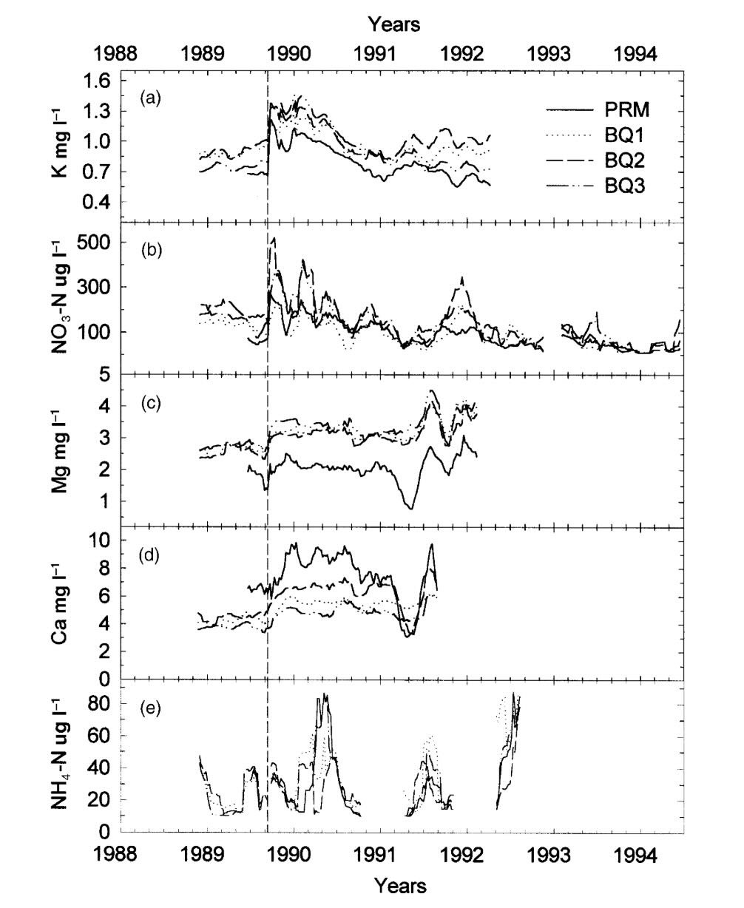
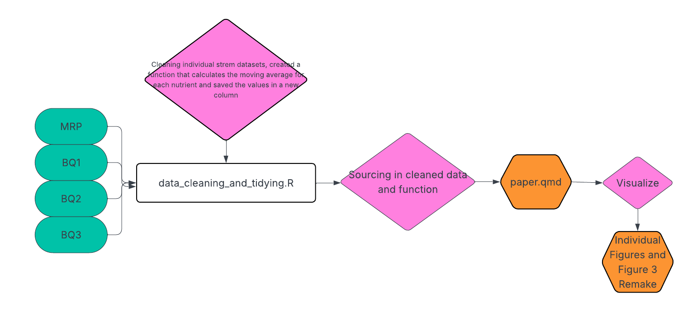
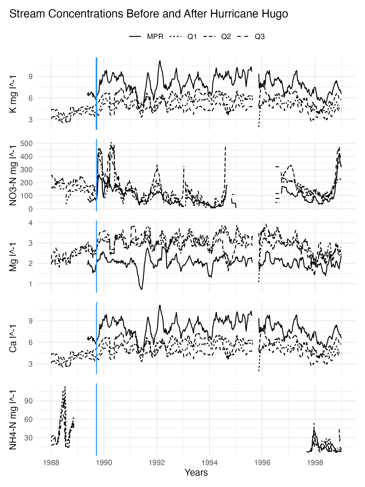

# Nutrients in Puerto Rico Streams Before and After Hurricane Hugo

This is the GitHub repository for Jaslyn Miura's analysis of Puerto Rico Stream data for EDS 214.

For this assignment we were tasked with recreating the following figure (Schaefer, et al, 2000):

## Directory

The eds214-PR-stream directory contains:

**data**: raw and derived data

**figures**: final plot

**paper**: final qmd document that renders to a GitHub Page

**scratch**: R scripts that attempt the analysis

**images**: images used in README

File name syntax:

The following work flow was used to recreate the figure:

Using the data within this directory and the workflow the following figure was produced along with a final paper.qmd file that creates a GitHub Page upon rendering:

### References

Schaefer DouglasA, McDowell WH, Scatena FN, Asbury CE. Effects of hurricane disturbance on stream water concentrations and fluxes in eight tropical forest watersheds of the Luquillo Experimental Forest, Puerto Rico. *Journal of Tropical Ecology*. 2000;16(2):189-207. <doi:10.1017/S0266467400001358>

McDowell, W. and International Institute of Tropical Forestry(IITF), USDA Forest Service.. 2024. Chemistry of stream water from the Luquillo Mountains ver 4923064. Environmental Data Initiative. <https://doi.org/10.6073/pasta/f31349bebdc304f758718f4798d25458> (Accessed 2025-08-29).
